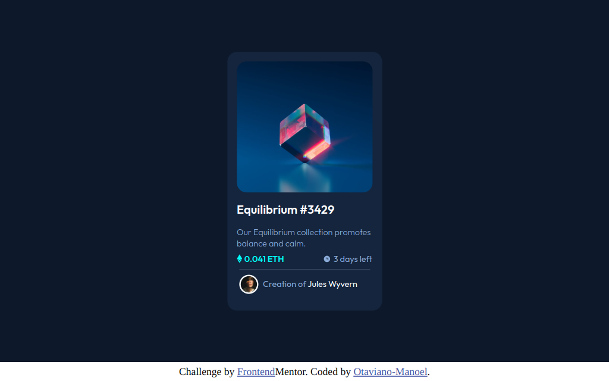
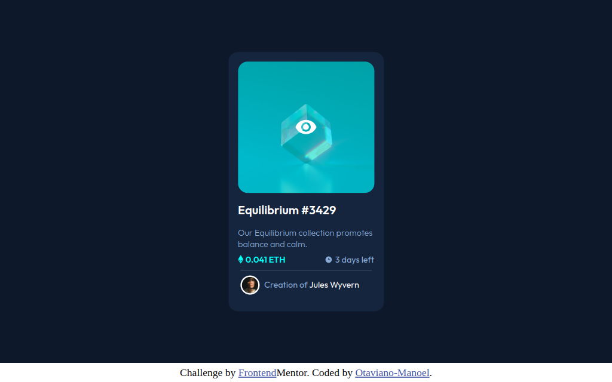
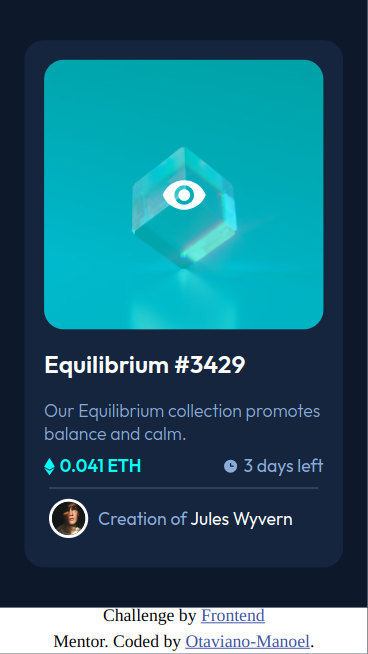

# Frontend Mentor - NFT preview card component solution

This is a solution to the [NFT preview card component challenge on Frontend Mentor](https://www.frontendmentor.io/challenges/nft-preview-card-component-SbdUL_w0U). Frontend Mentor challenges help you improve your coding skills by building realistic projects. 

## Table of contents

- [Overview](#overview)
  - [The challenge](#the-challenge)
  - [Screenshot](#screenshot)
  - [Links](#links)
- [My process](#my-process)
  - [Built with](#built-with)
  - [What I learned](#what-i-learned)
  - [Continued development](#continued-development)
- [Author](#author)

## Overview

### The challenge

### Screenshot







### Links

- Solution URL: [Add solution URL here](https://www.frontendmentor.io/solutions/display-flex-NfpduQXUTE)
- Live Site URL: [Add live site URL here](https://your-live-site-url.com)

## My process

### Built with

- Semantic HTML5 markup
- CSS custom properties
- Flex

### What I learned

In this HTML with CSS project, I chose to improve my use of display: flex and its ways of aligning flexible elements.

Alignment method applied in this project.
```css
.background {
    display: flex;
    justify-content: center;
    align-items: center;
}
```

Alignment method applied in my last project.
```css
main {
    position: absolute;
    top: 50%;
    left: 50%;
    transform: translate(-50%, -50%);
}
```

### Continued development

I will continue working on HTML and CSS projects to improve myself. And now I'm going to look for a challenge that requires greater mobile responsiveness.

## Author
- Frontend Mentor - [@Otaviano Manoel](https://www.frontendmentor.io/profile/otaviano-manoel)
